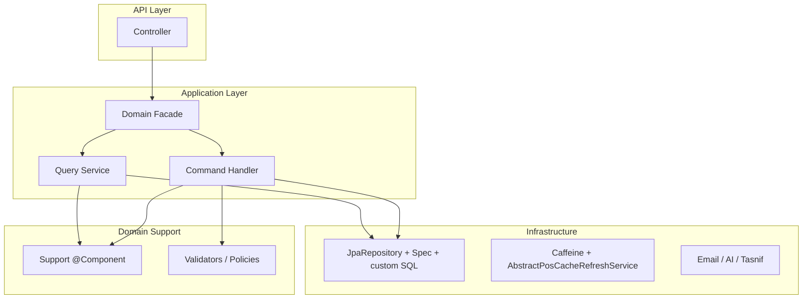

# Web Backend — Architecture Plan

Java 17 · Spring Boot 3.2 · PostgreSQL · JPA · MapStruct · JWT · Caffeine

Modular monolith для multi-tenant POS (касса, склад, отчёты, платформа).

> **Правила для команды (ежедневно):** [CODING_STANDARDS.md](./CODING_STANDARDS.md)  
> Этот файл — архитектура, паттерны и roadmap. Стандарты кода и PR checklist — в CODING_STANDARDS.

---

## 1. Цель

Сделать код **понятным за 30 минут** новому senior-разработчику:

- один домен = одна папка;
- один use-case = один класс;
- общая логика через **composition** (`@Component` Support), не через fat abstract;
- API наружу только через **DTO**;
- ошибки только через **PosException** + `GlobalExceptionHandler`.

Не цель: microservices, DDD aggregate везде, `BaseCrudService`, `BaseMapper<E,D>`.

---

## 2. Текущее состояние (честная оценка)

| Сильные стороны | Слабые места |
|-----------------|--------------|
| Facade: `ProductServiceImpl`, `SaleServiceImpl` | 8 классов >300 строк |
| CQRS-зачатки: Query / Command / Stock | `service/impl/` и `service/product/impl/` — два стиля |
| Payment Strategy (cash/card/mixed) | 50× `migration_manual_*.sql`, нет Liquibase |
| `PosException` + `GlobalExceptionHandler` | 13 тестов на ~595 Java-файлов |
| MapStruct + `PosMapperConfig` (ERROR policy) | `AbstractProductCatalogSupport` — наследование вместо composition |
| Tenant RLS (`TenantContext`, `TenantAccessSupport`) | `UserServiceImpl` (415 строк) — CRUD + PIN + email |
| Externalized SQL (`resources/sql/`) | LogUtil не везде |

**Вердикт:** production-ready modular monolith. Нужна **унификация паттернов**, не переписывание.

---

## 3. Целевая архитектура (слои)



### Правило потока данных

```
HTTP Request
  → Controller (orchestration, @Valid, Swagger)
  → Facade или Command/Query Service
  → Support / Repository
  → Entity (только внутри service/repository)
  → Mapper → DTO
  → HTTP Response
```

**Entity наружу не выходит.** `@AuthenticationPrincipal User` в контроллере — допустимо (Spring Security).

---

## 4. Паттерны — что использовать

### 4.1 Facade (публичный API домена)

**Когда:** контроллер вызывает один сервис, внутри — несколько подсервисов.

**Эталон в проекте:**

```java
// ProductServiceImpl — только делегирование
commandService.createProduct(req);
queryService.getProduct(id, storeId);
stockService.adjustStock(...);
```

**Правило:** Facade ≤ 200 строк. Только `@Transactional` на write-методах и `LogUtil` на границах.

| Домен | Facade | Статус |
|-------|--------|--------|
| Product | `ProductServiceImpl` | OK |
| Sale | `SaleServiceImpl` | OK |
| User | `UserServiceImpl` | OK (~80 строк) |
| Report | `ReportServiceImpl` | OK (~110 строк, support/*) |
| Stock reports | `StockReportServiceImpl` | OK (TashkentPeriod + TextUtil) |

---

### 4.2 CQRS-lite (Command / Query)

**Когда:** домен с разной логикой чтения и записи (Product, Sale, User).

```
service/{domain}/
├── {Domain}Service.java           # interface для Facade
├── {Domain}QueryService.java        # read-only
├── {Domain}CommandService.java      # write
├── impl/
│   ├── {Domain}QueryServiceImpl.java
│   ├── {Domain}CommandServiceImpl.java   # thin orchestrator
│   ├── {Domain}CreateHandler.java        # один сценарий
│   └── {Domain}UpdateHandler.java
└── support/
    ├── {Domain}CatalogLoader.java
    └── {Domain}BarcodeValidator.java
```

**Command Handler** — один публичный метод, одна транзакция, `PosExceptions` для ошибок.

**Query Service** — `@Transactional(readOnly = true)`, без side-effects.

---

### 4.3 Support Component (composition)

**Когда:** общая логика используется в 2+ сервисах одного домена.

**Эталон:** `TenantAccessSupport`, `ProductLookupSupport`, `UserLookupSupport`.

```java
@Component
@RequiredArgsConstructor
public class ProductBarcodeValidator {
    public void assertUnique(Integer companyId, String barcode, UUID ignoreProductId) { ... }
}
```

| Нужно | Механизм | Пример |
|-------|----------|--------|
| Tenant-проверки | `@Component` | `TenantAccessSupport` |
| Lookup по spec | `@Component` | `ProductLookupSupport` |
| Валидация домена | `@Component` | `ProductBarcodeValidator` |
| Применение связей | `@Component` | `ProductStorePriceApplier` |
| Загрузка entity + init lazy | `@Component` | `ProductCatalogLoader` |

**Не делать:** `AbstractProductCatalogSupport`, `AbstractUserService`, `AbstractCrudService`.

---

### 4.4 Abstract class — только template method

**Когда:** один и тот же алгоритм, разные шаги реализации.

**Approved (единственные service-level abstract):**

| Класс | Алгоритм |
|-------|----------|
| `AbstractPosCacheRefreshService<S>` | load → replace → log |
| `AbstractSnapshotCache<T>` | atomic snapshot get/replace/clear |

**Не добавлять** новые abstract для CRUD, tenant, mapping.

---

### 4.5 Strategy

**Когда:** варианты одного действия по типу.

**Уже есть:** `SalePaymentStrategy` → `CashPaymentStrategy`, `CardPaymentStrategy`, `MixedPaymentStrategy`.

**Кандидаты на Strategy (фаза 2):** import source handlers (`CatalogImportSourceHandler`, `UzInvoiceImportSourceHandler` — уже strategy-like).

---

### 4.6 Exception — PosException hierarchy

```
PosException
├── BadRequestException       # validation, business rule
├── ResourceNotFoundException # 404
├── ConflictException         # 409, unique constraint
└── CacheRefreshException     # internal cache
```

**Правило throw:**

```java
// Предпочитать фабрику
throw PosExceptions.notFound("Product", id);
throw PosExceptions.badRequest("SKU already exists: " + sku);
throw PosExceptions.conflict("Barcode already in use", "barcode", barcode);

// Прямой конструктор — только если нужен cause/context
throw new BadRequestException("...", Map.of("field", value));
```

**Не создавать:** `BusinessException`, `ValidationException` — дублируют существующие.

---

### 4.7 Mapper — MapStruct config, не BaseMapper

```java
@Mapper(config = PosMapperConfig.class)
public interface ProductMapper { ... }
```

`PosMapperConfig`: `unmappedTargetPolicy = ERROR`, constructor injection.

**Правило:** один mapper на aggregate. Сложный mapping → `default` methods или отдельный mapper, не `@Component` hand-written mapper.

---

### 4.8 Repository

```
repository/
├── {Entity}Repository.java          # extends JpaRepository
├── spec/{Entity}Specifications.java # dynamic filters
└── {domain}/impl/                   # heavy SQL (reports, analytics)
    └── StockReportRepositoryImpl.java
```

**Без** `BaseRepository`. Shared lookup → `*LookupSupport` в service layer.

---

### 4.9 Controller

- Только orchestration: validate → call service → return DTO.
- Swagger: `@Tag`, `@Operation`, `@StandardApiResponses`.
- **Без** repository, **без** business logic (кроме trivial guard в 1–2 строки).

---

## 5. Структура пакетов (целевая)

```
com.pos/
├── controller/              # REST API (31 файла)
├── service/
│   ├── impl/                # Facades legacy → постепенно в {domain}/
│   ├── product/             # Bounded context: catalog
│   │   ├── ProductCommandService.java
│   │   ├── ProductQueryService.java
│   │   ├── impl/
│   │   │   ├── ProductCreateHandler.java
│   │   │   ├── ProductUpdateHandler.java
│   │   │   └── ProductCommandServiceImpl.java  # thin
│   │   └── support/
│   │       ├── ProductCatalogLoader.java
│   │       ├── ProductBarcodeValidator.java
│   │       └── ProductStorePriceApplier.java
│   ├── sale/                # checkout, query, void, payment/
│   ├── stock/
│   ├── user/
│   │   ├── UserPinService.java
│   │   └── UserProvisioningService.java
│   ├── cashier/
│   ├── sync/
│   ├── ai/
│   ├── export/
│   ├── imports/
│   ├── analytics/
│   └── support/             # cross-domain: TenantAccessSupport, LogUtil callers
├── repository/
├── entity/
├── dto/
├── mapper/
├── exception/
├── config/
├── security/
├── cache/
├── domain/                  # enums: SaleType, ProductType, BusinessType
└── util/
```

**Правило именования:**

| Тип | Имя |
|-----|-----|
| Interface | `ProductCommandService` |
| Impl | `ProductCommandServiceImpl` |
| Handler | `ProductCreateHandler` |
| Support | `ProductBarcodeValidator` |
| Facade | `ProductServiceImpl` implements `ProductService` |

---

## 6. Bounded contexts (домены)

| Context | Ключевые классы | Приоритет рефакторинга |
|---------|-----------------|------------------------|
| **Catalog** | Product*, Category*, BusinessType* | P0 — split Command |
| **Sales** | Sale*, Return* | OK (facade есть) |
| **Stock** | StoreStock*, StockReport* | P1 — split reports |
| **Cashier** | CashierShift*, ZReport* | P2 |
| **Identity** | User*, Auth* | OK — handlers + UserAccessPolicy |
| **Platform** | Company*, PlatformSecurity*, ModuleAccess* | P2 |
| **Sync** | CashierSync* | P1 |
| **Analytics** | Report*, AI* | P2 |

---

## 7. План внедрения (PR series)

### PR-1: Документация + conventions (этот файл)

- [x] `ARCHITECTURE.md`
- [ ] Checklist в PR template: Facade? DTO? PosExceptions? LogUtil?

### PR-2: Product domain — composition over inheritance

**Удалить:** `AbstractProductCatalogSupport`

**Создать:**

```
service/product/support/
├── ProductCatalogLoader.java      # findById, findDetailed, loadStoreCounts, initCollections
├── ProductBarcodeValidator.java   # assertUnique, assertNoDuplicatesInRequest
└── ProductStorePriceApplier.java  # applyStorePrices, applyExtraBarcodes, syncWithSelling
```

**Создать handlers:**

```
service/product/impl/
├── ProductCreateHandler.java      # create + reactivate (~120 lines)
├── ProductUpdateHandler.java      # applyUpdates (~100 lines)
└── ProductCommandServiceImpl.java # delegates (~60 lines)
```

**Обновить:** `ProductQueryServiceImpl`, `ProductStockServiceImpl` — inject Support, убрать extends.

**Критерий готовности:** `mvn test` green, API `/products` без изменений контракта.

---

### PR-3: User domain — split без abstract

```
service/user/
├── UserQueryService.java          # findAll, findById, canView
├── UserProvisioningService.java   # create, update, toggleActive
├── UserPinService.java            # applyPin, assertUniquePin
├── UserCredentialEmailService.java # sendCredentials (wrap EmailService)
└── impl/UserServiceImpl.java      # facade (~80 lines)
```

**Критерий:** `UserServiceImpl` ≤ 100 строк.

---

### PR-4: PosExceptions + LogUtil discipline

- Replace `new ResourceNotFoundException("Product not found: " + id)` → `PosExceptions.notFound("Product", id)` в product/user handlers.
- Add `LogUtil.info/warn` на create/update/delete в handlers.
- Optional: ArchUnit rule `services should not throw generic RuntimeException`.

---

### PR-5: Liquibase (ops maturity) ✅

```
resources/db/changelog/
├── db.changelog-master.xml
├── v1-baseline.xml          # app_schema_migrations + schema.sql (пустая БД)
└── v2-incremental.xml       # 39 changesets из migrations-prod.txt
```

- `spring.liquibase.enabled=true` (профили local/prod)
- `deploy/migrate-db.sh` — fallback без рестарта backend
- `ddl-auto: validate` сохраняется
- Новые миграции: SQL в `db/` + changeset в `v2-incremental.xml`

---

### PR-6: Stock reports split (P1)

```
repository/report/
├── StockBalanceReportRepository.java
├── StockTurnoverReportRepository.java
└── impl/...
```

`StockReportController` → делегирует в sub-controllers или один controller с `@RequestMapping` groups.

---

### PR-7: Tests — critical paths

| Test | Что покрывает |
|------|---------------|
| `ProductCreateHandlerTest` | create, duplicate SKU, barcode unique |
| `UserPinServiceTest` | PIN digest, duplicate PIN |
| `AuthServiceImplTest` | login, cashier PIN login |
| `SaleCheckoutServiceTest` | checkout happy path |
| `GlobalExceptionHandlerTest` | уже есть |

Цель: не 80% coverage, а **рефакторить без страха**.

---

## 8. Anti-patterns (запрещено)

| Anti-pattern | Почему | Альтернатива |
|--------------|--------|--------------|
| `BaseCrudService<E,D>` | Скрывает ответственность | Facade + Command/Query |
| `BaseMapper<E,D>` | MapStruct config достаточно | `PosMapperConfig` |
| `BaseController` | Нет общего CRUD | Thin controllers |
| `extends AbstractXxxSupport` для shared deps | Tight coupling | `@Component` Support |
| Entity в response | Утечка persistence | DTO + Mapper |
| Logic в controller | Нет testability | Service/Handler |
| `logger.info` в service | Нет единого формата | `LogUtil.info(Class, ...)` |
| Static business logic | Нет DI | `@Component` |
| Новый abstract service | Кроме cache template | Support component |

---

## 9. Checklist для нового кода (PR review)

```
[ ] Controller → DTO in/out, no repository
[ ] Service has interface + impl (or Handler for single use-case)
[ ] Exceptions via PosExceptions or PosException subclass
[ ] Logging via LogUtil on write operations
[ ] Mapper via MapStruct + PosMapperConfig
[ ] Tenant checks via TenantAccessSupport
[ ] File ≤ 200 lines (handler) / ≤ 300 (service)
[ ] Test for non-trivial business rule
[ ] Liquibase changelog if schema changed
```

---

## 10. Пример: Product Create (целевой код)

```java
@Service
@RequiredArgsConstructor
public class ProductCreateHandler {

    private final ProductCatalogLoader catalog;
    private final ProductBarcodeValidator barcodes;
    private final ProductStorePriceApplier storePrices;
    private final TenantAccessSupport tenant;
    private final ProductRepository productRepository;
    private final ProductResponseAssembler assembler;

    @Transactional
    public ProductResponse create(CreateProductRequest req) {
        Integer companyId = tenant.requireEffectiveCompanyId();
        barcodes.validateForCreate(companyId, req.barcode(), req.additionalBarcodes(), null);
        // ... build entity, save, apply store prices
        LogUtil.info(ProductCreateHandler.class, "Product created: id={}, sku={}", saved.getId(), saved.getSku());
        return assembler.toResponse(saved);
    }
}
```

```java
@Service
@RequiredArgsConstructor
public class ProductCommandServiceImpl implements ProductCommandService {

    private final ProductCreateHandler createHandler;
    private final ProductUpdateHandler updateHandler;
    private final ProductRepository productRepository;

    @Override
    public ProductResponse createProduct(CreateProductRequest req) {
        return createHandler.create(req);
    }
    // bulk ops stay here (small, no handler needed)
}
```

---

## 11. Метрики успеха

| Метрика | Сейчас | Цель |
|---------|--------|------|
| Классов >300 строк | 8 | 0 |
| `extends Abstract*Support` | 3 product services | 0 |
| Тестов (unit) | 69 | 30+ ✅ |
| Liquibase | да (PR-5) | да |
| LogUtil в write services | ~60% | 100% |
| PosExceptions vs raw throw | mixed | handlers 100% |

---

## 12. Порядок работ (summary)

1. **PR-2 Product** — composition, handlers (максимальный impact для demo архитектору)
2. **PR-3 User** — Pin/Provisioning split
3. **PR-4 PosExceptions + LogUtil**
4. **PR-5 Liquibase**
5. **PR-6 Stock reports**
6. **PR-7 Tests** — handlers: ProductCreate, UserPin, StockDocument + util tests

Каждый PR — отдельный review, API contract не ломается, deploy без downtime.
